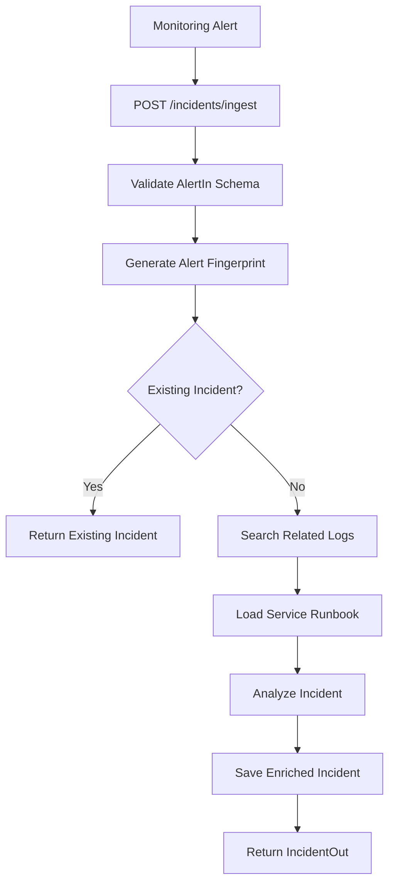
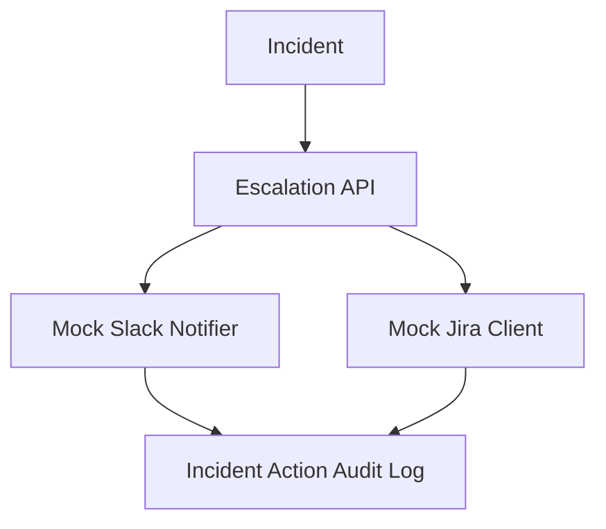

# AI Incident Copilot Architecture

The AI Incident Copilot is designed as a small but production-style incident-triage backend. It receives monitoring alerts, deduplicates repeated alerts, enriches new incidents with operational context, and returns an AI-style incident summary.

## High-level flow

## Layers

### API layer

`app/api/incidents.py` owns the HTTP interface. It validates requests, handles status codes, coordinates service calls, and returns response models.

### Schema layer

`app/schemas/incident.py` defines the API contracts. These schemas prevent invalid input and keep response payloads consistent.

### Persistence layer

`app/db/session.py` configures SQLAlchemy. `app/models/incident.py` defines the incident table and stores alert, lifecycle, and AI-analysis fields.

### Service layer

The service layer holds reusable business logic:

- `fingerprint.py`: creates stable fingerprints for alert deduplication.
- `log_search.py`: simulates observability/log lookup.
- `runbook_store.py`: simulates service runbook retrieval.
- `ai_analyzer.py`: generates symptoms, probable cause, actions, and postmortem summaries.

## Production extension points

This repo intentionally uses local-friendly mocks. In a production version, the following replacements would be natural:

| Current Module | Production Replacement |
| --- | --- |
| `log_search.py` | Datadog, Splunk, CloudWatch Logs, OpenSearch, or Dynatrace API |
| `runbook_store.py` | Confluence, Notion, GitHub markdown docs, Backstage catalog, or vector database |
| `ai_analyzer.py` | OpenAI API, Azure OpenAI, Bedrock, or internal LLM gateway |
| SQLite | PostgreSQL or MySQL |
| Local API | Kubernetes, ECS, or serverless deployment |

## Why this design works

The API does not directly know how logs, runbooks, or AI analysis are implemented. Each concern lives in its own module, which keeps the code testable and makes future integrations easier to add.

## Commit 6: Escalation and Collaboration Layer

The system now includes a collaboration layer that simulates the actions an incident copilot would take after triage:

### Why this matters

Real incident platforms do more than analyze alerts. They also coordinate response work. This commit adds that workflow while keeping external integrations mocked so the project remains easy to run locally and test in CI.

### Extension points

- Replace `MockSlackNotifier` with Slack Web API calls.
- Replace `MockJiraClient` with Jira REST API ticket creation.
- Add PagerDuty/Opsgenie escalation policies.
- Add webhook retries and a dead-letter queue for failed outbound actions.
- Add role-based permissions around who can escalate or resolve incidents.
